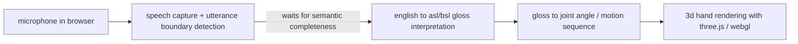

# solution

## core pipeline

## how each stage works

### 1. speech capture and boundary detection

speechmatics or assemblyai captures audio from the browser microphone and returns real-time transcription with utterance-boundary signals. the system does not pass every word downstream — it holds the buffer until it detects a boundary event (a confident end-of-clause or end-of-sentence signal from the api).

for utterances where semantic completeness can't be confirmed from the first pause — for example, when an english clause ends on a conjunction, or where the topic hasn't resolved — the system can hold for one additional sentence before committing. it does not hold indefinitely. a hard timeout ensures the signed output never falls more than two sentences behind the speaker.

### 2. english → gloss interpretation

a fine-tuned language model converts the completed english utterance into asl or bsl gloss. this is not a word-substitution step. the model is trained to produce grammatically correct sign language gloss, which means:

- topic-comment sentence structure (asl)
- bsl-specific grammar and word order (distinct from both asl and english)
- correct handling of idioms, pronouns, and temporal markers
- omission of english filler words with no signed equivalent

adaptionlabs' adaptive data platform is used to build the training dataset (english utterance → gloss pairs), and autoscientist is used to optimize the fine-tuning recipe. both asl and bsl are separate model outputs — they are not the same language and are not treated as variants.

### 3. gloss → motion mapping

each gloss token maps to a motion sequence: a set of hand joint angles, wrist orientation, location in space, and transition timing. for the hackathon build, this is a lookup-table approach against a fixed vocabulary — not generative motion synthesis. this keeps the layer fast, predictable, and easy to debug.

### 4. 3d hand rendering

a low-poly rigged hand model renders in a browser tab using three.js. the model receives the joint angle sequence from the mapping layer and animates procedurally. the output is a signing hand — no subtitles, no scrolling text, no english. just the interpretation, in the target language's own visual form.

the user controls:
- language toggle: asl / bsl
- a settings panel to adjust signing speed and hand size
- start / stop listening

## why this stack

- **browser-native**: no install, no app, works wherever the user is watching a lecture or stream
- **speechmatics / assemblyai**: best-in-class utterance boundary detection, which is the hardest single problem in the pipeline
- **adaptionlabs**: lets us build a domain-specific english-to-gloss model from structured training data rather than prompting a general-purpose llm and hoping it knows asl grammar
- **three.js**: mature, well-documented, runs well in-browser, low-poly is a first-class use case

## what makes this different

every prior attempt at automated sign language output either (a) does word-substitution rather than interpretation, or (b) focuses on recognition (sign → text) rather than production (text → sign). glovterpreter is one of very few projects treating speech-to-sign as an interpretation problem end-to-end, with the linguistic distinction between gloss and transcription built into the architecture from the start.